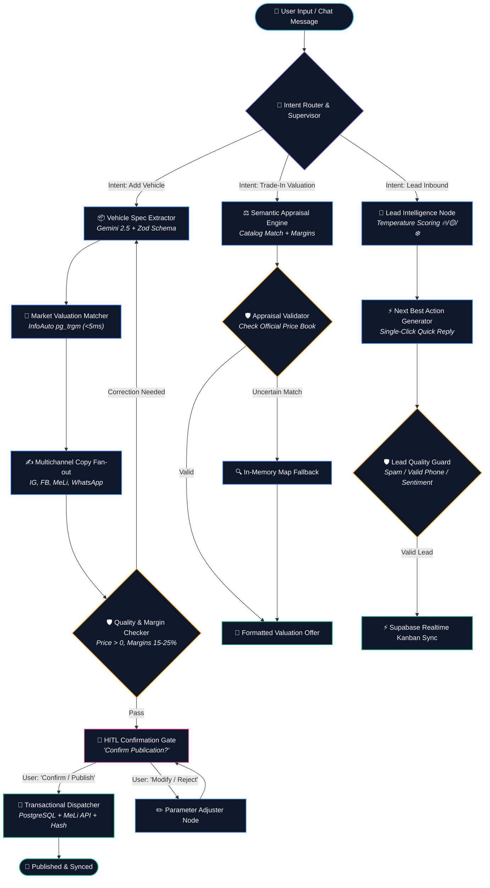

# 🧠 AutoApp Agent Graph — Living Architecture & State Machine

> **Multi-Agent Orchestration Blueprint:** This document defines the state graph, specialized worker nodes, independent verification gates (*checker nodes*), and Human-in-the-Loop (HITL) breakpoints for the AutoApp Copilot and Assistant, implementing state-of-the-art **Agent Graph** design patterns.

---

## 1. 🎯 Core Architectural Principles

Reflecting the modern evolution of autonomous AI agent design:
1. **Deconstruction of the Monolith:** Rather than overloading a single massive prompt with contradictory tasks (extraction, valuation, multichannel copywriting, margin enforcement, database insertion, and third-party API calls), the workflow is decomposed into **isolated, single-responsibility nodes**.
2. **"An Agent Should Never Grade Its Own Homework":** Generative nodes never evaluate their own work. An independent verification node (*Quality & Margin Checker Gate*) deterministically validates data schemas, profit margin boundaries (15–25%), and sanity bounds before mutations occur.
3. **Typed Shared State (*State Blackboard*):** Every node reads and updates an immutable, serializable state object (`AutoAppState`) that preserves context, audit telemetry, and time-travel traceability.
4. **Human-in-the-Loop Breakpoints (HITL):** High-impact or irreversible commercial operations (such as publishing paid classified listings or adjusting inventory prices) halt execution, presenting a preview and awaiting explicit human confirmation.
5. **Concurrent Execution (*Fan-Out / Fan-In*):** Independent sub-tasks (e.g., generating tailored copy for Instagram, Facebook Marketplace, MercadoLibre, and WhatsApp simultaneously) execute in parallel.

---

## 2. 🗺️ State Machine & Agent Graph Diagram



---

## 3. 📦 Graph State Structure (`AutoAppState`)

Every graph traversal reads and mutates a strictly typed state contract:

```typescript
export interface AutoAppState {
  // 1. Session & Tracking
  sessionId: string
  userId: string
  agencyId: string
  channel: 'WEB_CHAT' | 'WHATSAPP' | 'TELEGRAM'

  // 2. Raw Input & Context
  inputMessage: string
  photoUrls: string[]

  // 3. Routing & Navigation
  intent?: 'ADD_STOCK' | 'APPRAISAL' | 'LEAD_CRM' | 'CONFIRM_PUBLISH' | 'GENERAL_FAQ'
  confidence?: number
  currentNode: string
  executionPath: string[] // e.g., ['router (8ms)', 'extractor (210ms)', 'valuation (3ms)']

  // 4. Extracted Domain Entities
  draftVehicle?: {
    marca: string
    modelo: string
    version?: string
    anio: number
    km: number
    precio_venta: number
    precio_entrega?: number
    patente?: string
    tipo_combustible: string
    transmision: string
    descripcion?: string
    ID?: string
    FOTO_PORTADA?: string
    FOTOS_EXTRA?: string
  }

  // 5. Official Market Valuations & Margins
  officialValuation?: {
    tablePrice: number
    suggestedPurchasePrice: number
    suggestedSalePrice: number
    marginPercent: number
    liquidity: 'ALTA' | 'MEDIA' | 'BAJA'
    matchedModel: string
    matchedVersion: string
    source: 'POSTGRES_PG_TRGM' | 'IN_MEMORY_MAP' | 'AI_HEURISTIC'
  }

  // 6. Concurrent Copywriting Artifacts (Fan-Out)
  generatedCopies?: {
    instagram?: { hook: string; caption: string; hashtags: string[] }
    facebook?: { title: string; description: string; key_features: string[] }
    mercadolibre?: { title: string; description: string }
    whatsapp?: { status_text: string; chat_pitch: string }
  }

  // 7. Lead Evaluation (CRM Pipeline)
  leadEvaluation?: {
    temperatura: 'CALIENTE' | 'TIBIO' | 'FRIO'
    motivo: string
    nextBestAction: string
    sugerenciaRespuesta: string
  }

  // 8. Quality Assurance & Breakpoints
  validation: {
    passed: boolean
    errors: string[]
    warnings: string[]
    checkerName: string
    timestamp: number
  }
  requiresConfirmation: boolean
  confirmationPrompt?: string
  confirmationPayload?: any

  // 9. Final Output Payload
  outputReply: string
  action?: 'VEHICLE_CREATED' | 'VEHICLE_PUBLISHED' | 'APPRAISAL_OFFER' | 'INFO'
}
```

---

## 4. 🧩 Node Inventory & Responsibilities

### Node 1: `Intent Router & Supervisor`
* **Input:** Raw user prompt + active session context.
* **Function:** Evaluates user intent with low latency using deterministic pattern matching and semantic classification (`ADD_STOCK`, `APPRAISAL`, `LEAD_CRM`, `CONFIRM_PUBLISH`, `GENERAL_FAQ`).
* **Output:** Conditional branch dispatching to the target subgraph.

### Node 2: `Vehicle Spec Extractor`
* **Input:** Informal, unstructured natural language messages (e.g., *"Just traded in a 2021 Cruze LTZ with 45k km for 24 million ARS"*).
* **Function:** Calls `gemini-2.5-flash` with a strict `Zod` validation schema (`ParsedVehicleSchema`) to enforce numeric normalization, standard transmission types, and verified Argentine license plate formatting.

### Node 3: `Market Valuation Matcher`
* **Input:** Vehicle make, model, version, and year.
* **Function:** Queries the PostgreSQL database with the `pg_trgm` extension and `GIN` inverted index in `< 5ms` across 8,184 catalog versions. Computes suggested dealership purchase price protecting retail margins (15–25%).

### Node 4: `Multichannel Copy Fan-out`
* **Input:** Structured vehicle record + photo attachments.
* **Function:** Concurrently produces channel-optimized copy (`Promise.all`):
  - *Instagram:* Aspirational storytelling, feature highlights, and viral hashtags.
  - *Facebook Marketplace:* Down payment terms, trade-in willingness, and clear localized call-to-action.
  - *MercadoLibre:* Formal technical specs compliant with VIS category rules (MLA1744).
  - *WhatsApp:* Compact, punchy bullet points tailored for instant mobile messaging.

### Node 5: `Quality & Margin Checker` (Independent Verification Gate)
* **Principle:** *An agent should never grade its own homework.*
* **Function:** Deterministic evaluation node that enforces business rules:
  - Validates that mandatory fields (Make, Model, Year, Price) exist and fall within acceptable parameters (1990 <= Year <= Current + 1, Price > 0).
  - Flags severe underpricing or margin erosion against official InfoAuto reference prices.
  - Verifies photo URLs against SSRF policies.
  - Halts execution and requests user correction if validation fails.

### Node 6: `HITL Confirmation Gate` (Human-in-the-Loop)
* **Function:** Pauses graph execution before any irreversible mutation. Generates an interactive preview:
  > *"🚘 2021 Chevrolet Cruze LTZ ready to publish on MercadoLibre for $24,000,000 ARS. Confirm publication?"*
* **Behavior:** Waits for affirmative user response (*"Yes, publish"*) or edits.

### Node 7: `Transactional Dispatcher`
* **Function:**
  1. Transactionally persists the vehicle record into `DB_STOCK` or `DB_STOCK_OKM` in Supabase.
  2. Executes official server-to-server publication on MercadoLibre VIS API with automatic token rotation.
  3. Prepares browser hash payloads for the Auto-Cyborg 360 extension (`#autoapp=...`, `#autoapp_ig=...`).
  4. Returns final URLs and execution confirmation.

---

## 5. 🔄 Lifecycle & Future Graph Extensions

As AutoApp grows, this living graph easily accommodates new specialized nodes without regressions:
- **`Audio Voice Note Ingestor Node`:** Automatic transcription and intent parsing of voice messages from WhatsApp.
- **`Loan & Financing Calculator Node`:** Real-time generation of bank loan schedules and monthly payment breakdowns during negotiation.
- **`Vehicle Title OCR Auditor Node`:** Computer vision extraction of vehicle ownership titles (*Cédula Verde*) for automated catalog preloading.
