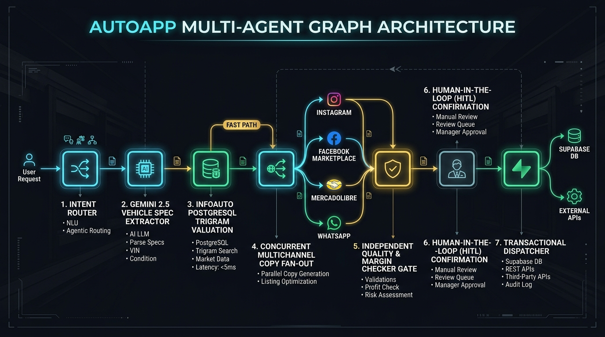
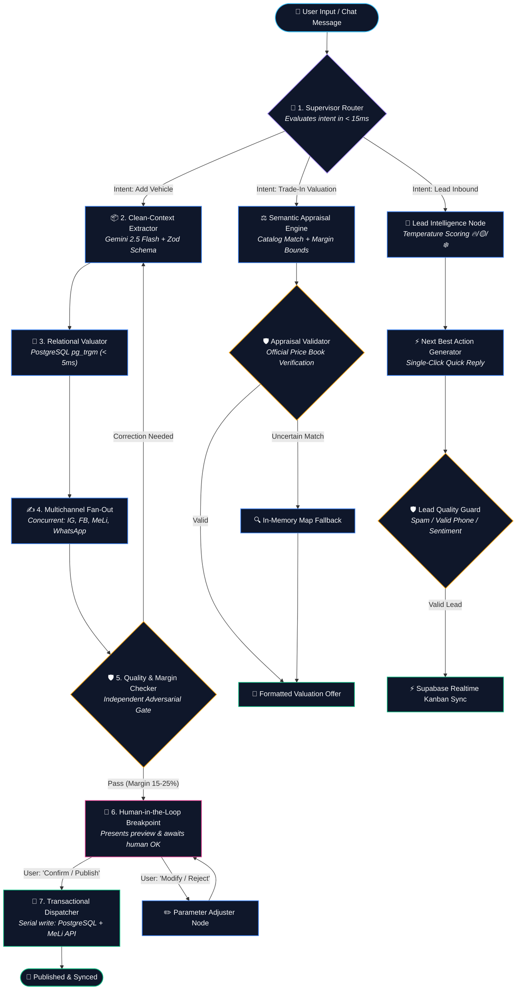

# 🚗 AutoApp — Agentic AI Architecture & State Machine in Production

> **Production Multi-Agent Blueprint:** This document outlines the architectural patterns, state machine, specialized worker nodes, independent verification gates (*adversarial checkers*), and Human-in-the-Loop (HITL) breakpoints implemented in the AutoApp Copilot and Operations Assistant.



---

## 📌 1. The Real-World Problem: Why Monolithic Mega-Prompts Fail

In automotive retail dealerships, commercial information arrives informally across chat channels (e.g., WhatsApp audio or text from sales reps: *"Hey, just took in a 2021 Toyota Corolla XEI with 45k km, clean title, asking 22M ARS"*).

When building early prototypes, the natural instinct was to feed everything into a single, monolithic LLM prompt responsible for:
1. Extracting vehicle specifications.
2. Estimating official valuation against market books.
3. Calculating dealership margins.
4. Writing multichannel advertising copy.
5. Mutating production databases.

### The Production Failure Modes
In production, this monolithic approach inevitably breaks:
* **The Non-Linear Error Trap:** In multi-step pipelines without deterministic gates, the overall probability of success decays exponentially:
  $$\mathbf{P}(\text{success}) = \prod_{i=1}^{n} p_i = p_1 \times p_2 \times \dots \times p_n$$
  Even with a seemingly high 95% step accuracy across 10 sequential tasks, the end-to-end reliability drops below 60%.
* **Cognitive Drift & Price Hallucinations:** A single prompt tasked with both creative writing and arithmetic frequently hallucinates catalog prices or erodes profit margins.
* **Lack of Auditability & Reversibility:** When an agent acts as a black box directly mutating database tables, tracking regressions or rolling back state becomes nearly impossible.

---

## 🏗️ 2. Architectural Blueprint & State Machine

To solve these failure modes, **AutoApp** deconstructs the monolith into a **modular state machine** guided by five foundational principles:
1. **Harness Engineering ("Humans Steer, Agents Execute"):** Software engineers design the typed constraints, linters, schemas, and checkpoints; agents perform the execution within that bounded sandbox.
2. **"An Agent Should Never Grade Its Own Homework":** Generative worker nodes never evaluate their own output. Verification is handed off to independent adversarial checker nodes.
3. **Clean-Context Workers:** Each worker node operates with isolated, minimal context—eliminating memory bloat and context degradation.
4. **Deterministic Relational Grounding (< 5ms):** Never ask an LLM to estimate prices from memory. Ground pricing directly against indexed relational tables (PostgreSQL `pg_trgm` GIN index).
5. **Serial Mutations vs. Parallelized Reads:** State mutations are strictly serialized and transactional. Read-only operations (multichannel copy generation) run concurrently.



---

## 📦 3. Typed State Contract (`AutoAppState`)

Every node in the graph interacts with an immutable, serializable blackboard state. This ensures zero data loss, full auditability, and time-travel debugging:

```typescript
export interface AutoAppState {
  // 1. Session & Tracking Context
  sessionId: string
  userId: string
  agencyId: string
  channel: 'WEB_CHAT' | 'WHATSAPP' | 'TELEGRAM'

  // 2. Raw Input & Multimodal Assets
  inputMessage: string
  photoUrls: string[]

  // 3. Routing & State Flow Telemetry
  intent?: 'ADD_STOCK' | 'APPRAISAL' | 'LEAD_CRM' | 'CONFIRM_PUBLISH' | 'GENERAL_FAQ'
  confidence?: number
  currentNode: string
  executionPath: string[] // e.g., ['router (11ms)', 'extractor (210ms)', 'valuation (4ms)']

  // 4. Extracted Domain Entities (Validated by Zod)
  draftVehicle?: {
    marca: string
    modelo: string
    version?: string
    anio: number
    km: number
    precio_venta: number
    precio_entrega?: number
    patente?: string
    tipo_combustible: string
    transmision: string
    descripcion?: string
    ID?: string
    FOTO_PORTADA?: string
    FOTOS_EXTRA?: string
  }

  // 5. Official Market Valuations & Margins
  officialValuation?: {
    tablePrice: number
    suggestedPurchasePrice: number
    suggestedSalePrice: number
    marginPercent: number
    liquidity: 'ALTA' | 'MEDIA' | 'BAJA'
    matchedModel: string
    matchedVersion: string
    source: 'POSTGRES_PG_TRGM' | 'IN_MEMORY_MAP' | 'AI_HEURISTIC'
  }

  // 6. Concurrent Copywriting Artifacts (Fan-Out)
  generatedCopies?: {
    instagram?: { hook: string; caption: string; hashtags: string[] }
    facebook?: { title: string; description: string; key_features: string[] }
    mercadolibre?: { title: string; description: string }
    whatsapp?: { status_text: string; chat_pitch: string }
  }

  // 7. Lead Evaluation (CRM Pipeline)
  leadEvaluation?: {
    temperatura: 'CALIENTE' | 'TIBIO' | 'FRIO'
    motivo: string
    nextBestAction: string
    sugerenciaRespuesta: string
  }

  // 8. Quality Assurance & Breakpoints
  validation: {
    passed: boolean
    errors: string[]
    warnings: string[]
    checkerName: string
    timestamp: number
  }
  requiresConfirmation: boolean
  confirmationPrompt?: string
  confirmationPayload?: any

  // 9. Final Output Payload
  outputReply: string
  action?: 'VEHICLE_CREATED' | 'VEHICLE_PUBLISHED' | 'APPRAISAL_OFFER' | 'INFO'
}
```

---

## 🧩 4. Node Inventory & Responsibilities

### Node 1: `Supervisor Router & Intent Classifier`
* **Role:** Lightweight Intent Classification (Routing Pattern).
* **Execution:** Evaluates user prompt in `< 15ms` using deterministic pattern matching and semantic classification.
* **Benefit:** Eliminates token waste. Unrelated inquiries (e.g., business hours) bypass heavy vehicle appraisal logic entirely.

### Node 2: `Clean-Context Spec Extractor`
* **Role:** Unstructured-to-Structured Transformation (Worker Pattern).
* **Execution:** Powered by `gemini-2.5-flash` with a strict `Zod` schema. Parses informal conversational input into normalized vehicle fields (Make, Model, Year, Mileage, Price, Transmission).
* **Safety:** Operates in an isolated prompt without prior conversational baggage, minimizing hallucinations.

### Node 3: `Relational Valuation Engine`
* **Role:** Deterministic Factual Grounding (Anti-Hallucination).
* **Execution:** Bypasses LLM parametric memory. Performs fuzzy string matching across 8,184 vehicle catalog records in PostgreSQL using `pg_trgm` and GIN indexing in `< 5ms`.
* **Business Logic:** Automatically calculates target dealership margin:
  $$\text{Margin} = \frac{\text{Sale Price} - \text{Book Price}}{\text{Sale Price}} \times 100$$

### Node 4: `Multichannel Copy Fan-Out`
* **Role:** Parallelized Generation (Fan-Out Pattern).
* **Execution:** Concurrently produces 4 platform-optimized advertising copies (`Promise.all`):
  - **Instagram:** Aspirational tone, key vehicle highlights, emoji formatting, and relevant hashtags.
  - **Facebook Marketplace:** Focus on down payment options, trade-in willingness, and location.
  - **MercadoLibre:** Structured technical specifications strictly adhering to portal policies.
  - **WhatsApp:** Compact, high-readability bullet points formatted for direct customer chats.
* **Efficiency:** Reduces end-to-end copywriting latency from ~10s down to ~2.5s.

### Node 5: `Quality & Margin Checker Gate`
* **Role:** Independent Adversarial Verification (Validator Pattern).
* **Principle:** *An agent should never grade its own homework.*
* **Execution:** Non-generative, deterministic validation gate that enforces non-negotiable business invariants:
  - Validates mandatory fields and numeric sanity bounds ($1990 \le \text{Year} \le \text{Current} + 1$, $\text{Price} > 0$).
  - **Neuro-Symbolic Guardian:** Halts execution if gross margin drops below 15% without manager override.
  - Validates image URLs against Server-Side Request Forgery (SSRF) filters.

### Node 6: `Human-in-the-Loop (HITL) Breakpoint`
* **Role:** Safe Governance & Checkpoint Suspension.
* **Principle:** *Humans Steer, Agents Execute.*
* **Execution:** The state machine suspends execution before any mutation occurs. Generates an interactive preview card for the human sales representative:
  > *"🚘 2021 Toyota Corolla XEI ready to publish on MercadoLibre for $22,000,000 ARS (Projected Margin: 18.2%). Confirm publication?"*
* **Behavior:** Waits for explicit user confirmation via web interface or chat trigger.

### Node 7: `Transactional Dispatcher`
* **Role:** Serial State Mutation & Marketplace Ingestion.
* **Execution:** Executed only upon affirmative human confirmation:
  1. Serial transactional write to PostgreSQL (`DB_STOCK`).
  2. Server-to-server publishing on MercadoLibre VIS API with automatic token rotation.
  3. Prepares browser hash payloads for automated Chrome extension synchronization.
  4. Commits state and returns final URLs to the user.

---

## 🛡️ 5. Production Guardrails & Governance

| Layer | Technique | Purpose |
| :--- | :--- | :--- |
| **Ingress** | API Gateway + Fail-Closed JWT Proxy | Blocks unauthorized client calls; zero direct browser access to agent runtimes. |
| **Grounding** | PostgreSQL `pg_trgm` GIN Index | Eliminates price and spec hallucinations with sub-5ms relational lookups. |
| **Schemas** | Zod Contract Validation | Enforces strict typing and catches schema deviations at runtime. |
| **Business Logic** | Neuro-Symbolic Code Guardians | Hardcoded checks prevent selling below cost or eroding dealer margins. |
| **Governance** | Human-in-the-Loop (HITL) | High-impact mutations require explicit human confirmation before dispatch. |
| **Cost Optimization** | Payload Pruning & Prompt Caching | Strips unnecessary JSON payloads, cutting token overhead by up to 70%. |

---

## 🔬 6. Verification & Evals

Every state node is tested against deterministic unit and integration test suites:

```bash
# Run End-to-End Test Suites
node scripts/test_security_phase1.mjs       # Fail-Closed Auth & Anti-SSRF Proxy checks
node scripts/test_phase2_performance.mjs    # Valuation Engine sub-5ms latency benchmark
node scripts/test_phase3_ai.mjs             # Structured output validation with Gemini & Zod
node scripts/test_phase4_whatsapp_crm.mjs   # Realtime CRM sync and lead scoring checks
```

---

## 📄 License & Attribution

Distributed under the MIT License. Developed as part of the **AutoApp** B2B Automotive Ecosystem.
