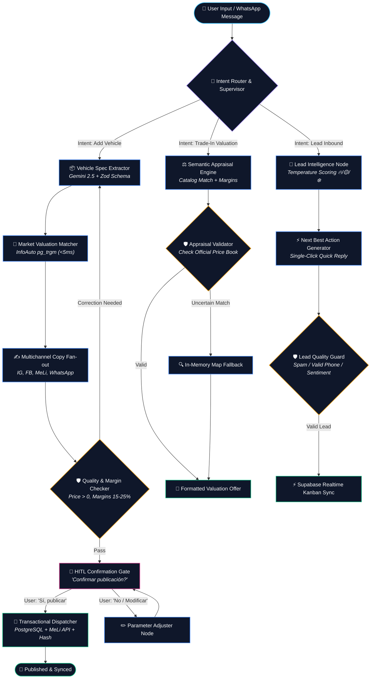

# 🧠 AutoApp Agent Graph — Living Architecture & State Machine

> **Blueprint de Orquestación Multi-Agente:** Este documento define el grafo de estados, nodos especializados, verificadores independientes (*checker nodes*) y puntos de interrupción con intervención humana (*Human-in-the-Loop*) para el Asistente y Copiloto de AutoApp, siguiendo las mejores prácticas de **Agent Graphs** (2026).

---

## 1. 🎯 Principios del Diseño del Grafo

Siguiendo la evolución de la arquitectura de agentes inteligentes:
1. **Descomposición del Monolito:** En lugar de saturar un único prompt gigante con todas las tareas (tasar, vender, redactar, validar y guardar), el sistema se divide en **nodos de responsabilidad única**.
2. **"No dejes que el agente califique su propio examen":** Los nodos generativos nunca se autoevalúan. Un nodo verificador independiente (*Guardrail / Validator Node*) valida esquemas `Zod`, márgenes de ganancia (15-25%) y coherencia de precios.
3. **Estado Compartido Tipado (*State Blackboard*):** Todo el flujo comparte un objeto inmutable de estado (`AutoAppState`) que acumula información y trazabilidad.
4. **Puntos de Interrupción Humana (*Human-in-the-Loop / Breakpoints*):** Las acciones irreversibles o de alto impacto comercial (publicar en MercadoLibre o alterar precios) detienen el grafo y aguardan confirmación explícita del usuario.
5. **Ejecución Paralela (*Fan-Out / Fan-In*):** Tareas independientes (como generar copys para 4 redes sociales simultáneas) se procesan concurrentemente.

---

## 2. 🗺️ Diagrama del Grafo de Estados (Agent Graph)



---

## 3. 📦 Estructura del Estado del Grafo (`AutoAppState`)

Cada invocación del grafo actualiza un estado tipado y serializable:

```typescript
export interface AutoAppState {
  // 1. Contexto de Sesión y Usuario
  sessionId: string
  userId: string
  agencyId: string
  channel: 'WEB_CHAT' | 'WHATSAPP' | 'TELEGRAM'
  
  // 2. Historial de Conversación
  messages: Array<{
    role: 'user' | 'assistant' | 'system'
    content: string
    timestamp: string
  }>

  // 3. Intención Clasificada
  intent?: 'ADD_STOCK' | 'APPRAISAL' | 'LEAD_INTELLIGENCE' | 'CONFIRM_ACTION' | 'GENERAL_FAQ'
  confidence?: number

  // 4. Entidades Vehiculares Extraídas
  draftVehicle?: {
    marca?: string
    modelo?: string
    version?: string
    anio?: number
    km?: number
    precioVenta?: number
    precioEntrega?: number
    patente?: string
    combustible?: string
    transmision?: string
    fotos: string[]
  }

  // 5. Cotizaciones Oficiales y Márgenes
  valuation?: {
    precioOficialInfoAuto: number
    precioCompraSugerido: number
    margenEstimadoPorcentaje: number
    liquidezMercado: 'ALTA' | 'MEDIA' | 'BAJA'
  }

  // 6. Copys Generados (Fan-Out)
  generatedCopies?: {
    instagram?: { hook: string; caption: string; hashtags: string[] }
    facebook?: { title: string; description: string; pricePrompt: string }
    mercadolibre?: { title: string; description: string; listingType: string }
    whatsapp?: { formattedSummary: string }
  }

  // 7. Prospecto (Lead) Analizado
  leadEvaluation?: {
    temperatura: 'CALIENTE' | 'TIBIO' | 'FRIO'
    motivo: string
    nextBestAction: string
    sugerenciaRespuesta: string
  }

  // 8. Control de Calidad y Human-in-the-Loop
  validationStatus: {
    passed: boolean
    errors: string[]
    warnings: string[]
    checkerName: string
  }
  pendingHumanConfirmation: boolean
  confirmationPayload?: any
}
```

---

## 4. 🧩 Inventario Detallado de Nodos

### Nodo 1: `Intent Router & Supervisor`
* **Entrada:** Mensaje del usuario + últimos 3 mensajes.
* **Función:** Clasifica la intención con baja latencia mediante prompt determinista o heurísticas regex de alta precisión (`/agrega|ingresa|tasame|lead/`).
* **Salida:** Enrutamiento condicional hacia el subgrafo correspondiente.

### Nodo 2: `Vehicle Spec Extractor`
* **Entrada:** Texto informal (ej: *"Tomamos un Cruze 2021 ltz con 45000 km en 23 palos"*).
* **Función:** Invoca `gemini-2.5-flash` con esquema estricto de `Zod` (`ParsedVehicleSchema`) para estructurar datos numéricos, normalizar cajas y combustibles.

### Nodo 3: `Market Valuation Matcher`
* **Entrada:** `marca`, `modelo`, `version`, `anio`.
* **Función:** Consulta a PostgreSQL con `pg_trgm` e índice `GIN` (`< 5ms`). Cruza con el catálogo oficial de 8,184 versiones y calcula precio de compra con margen del 15-25%.

### Nodo 4: `Multichannel Copy Fan-out`
* **Entrada:** Ficha consolidada del auto + fotos.
* **Función:** Genera concurrentemente variantes optimizadas para 4 plataformas (emocional con hashtags para Instagram, orientado a anticipo para Marketplace, técnico para MercadoLibre y conciso para WhatsApp).

### Nodo 5: `Quality & Margin Checker` (Verificador Independiente)
* **Principio:** *An agent should never grade its own homework.*
* **Función:** Nodo determinista que valida:
  - ¿El precio de venta es mayor a cero y coherente con el año?
  - ¿El margen de ganancia está entre 15% y 30%?
  - ¿Las URLs de fotos respetan la política anti-SSRF?
  - Si falla, redirige al nodo de extracción con feedback correctivo.

### Nodo 6: `HITL Confirmation Gate` (Interrupción Humana)
* **Función:** Detiene el flujo y genera la tarjeta interactiva:
  > *"🚘 Chevrolet Cruze 2021 LTZ listo para publicar en MercadoLibre por $23.000.000. ¿Deseas confirmar la publicación?"*
* **Comportamiento:** Espera el clic del usuario o una confirmación explícita (*"Sí, publicar"*).

### Nodo 7: `Transactional Dispatcher`
* **Función:**
  1. Inserta el vehículo en `DB_STOCK` o `DB_STOCK_OKM` en Supabase.
  2. Publica en MercadoLibre VIS API con auto-rotación de tokens.
  3. Prepara el hash para Auto-Cyborg 360 (`#autoapp=...`, `#autoapp_ig=...`).
  4. Retorna URLs directas y confirmación.

---

## 5. 🔄 Ciclo de Vida y Próximas Evoluciones

A medida que incorporemos nuevas capacidades al Asistente, este grafo se expandirá en los siguientes nodos:
- **`CRM WhatsApp Voice Node`:** Transcripción y análisis semántico de notas de voz enviadas por clientes.
- **`Financing Calculator Node`:** Cálculo de cuotas, tasas UVA y anticipos en tiempo real durante la conversación.
- **`Document OCR Auditor`:** Lectura de títulos del automotor o cédulas verdes para precargar datos sin error humano.
