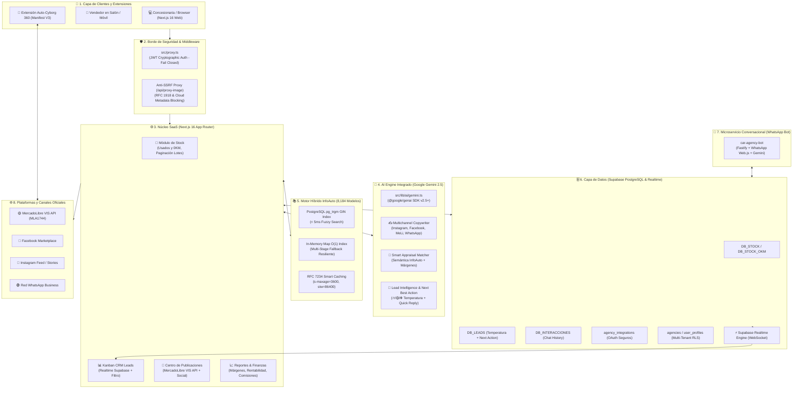
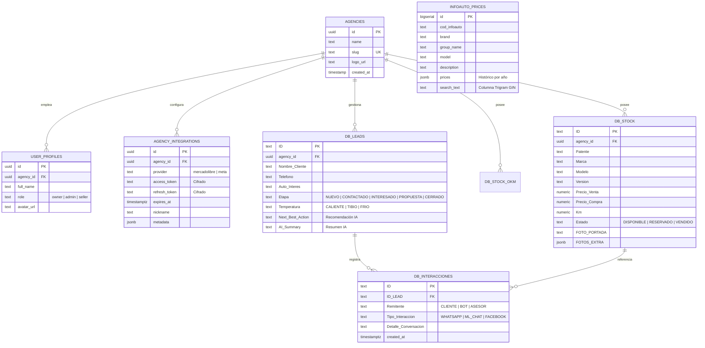
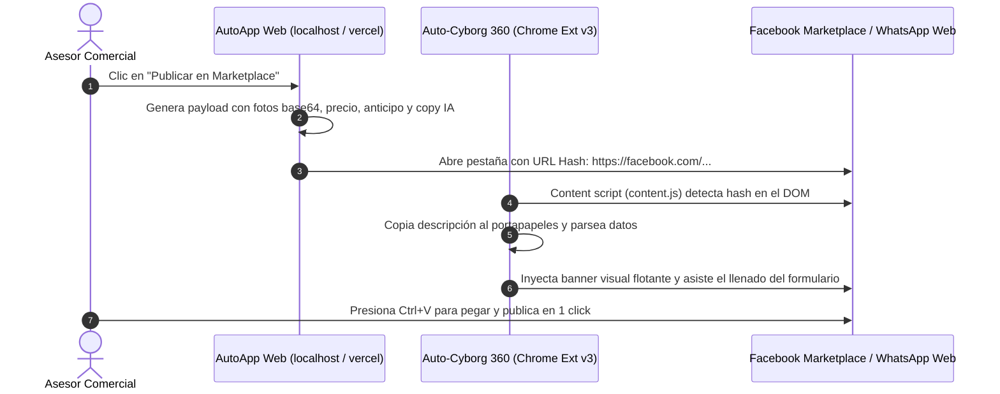

# 🗺️ MAPA INTEGRAL DEL ECOSISTEMA AUTOAPP
### Plataforma SaaS Automotriz B2B de Clase Mundial con IA & Automatización Multicanal


---

## 1. 🌐 Mapa Conceptual de Arquitectura Global (Mermaid)



---

## 2. 📊 Cuadro Maestro de Tecnologías, Lenguajes y Librerías

| Nombre Propio | Versión | Tipo / Categoría | Propósito en AutoApp |
| :--- | :---: | :--- | :--- |
| **Next.js** | `16.3.2` | Framework Web Full-Stack | App Router, Server Components, Server Actions y Route Handlers con empaquetado `standalone`. |
| **React** | `19.2.8` | Biblioteca de UI | Renderizado concurrente, hooks reactivos, `createPortal` para modales y gestión de eventos de arrastre. |
| **TypeScript** | `5.x` | Lenguaje Tipado | Tipado estricto (`strict: true`), contratos Zod, prevención de regresiones e interfaces unificadas. |
| **Tailwind CSS** | `v4` | Framework CSS Utilitario | Motor de estilos de alto rendimiento, gradientes oscuros, paleta Obsidian/Gold y diseño responsive. |
| **Google Gemini SDK** | `@google/genai` v2.5+ | SDK Oficial de IA | Inferencia con `gemini-2.5-flash`, generación de copys, tasación inteligente y análisis de prospectos. |
| **Zod** | `3.x` | Validación de Esquemas | Validación en runtime y tipado de salidas estructuradas JSON (*Structured Outputs*) de los modelos de IA. |
| **Supabase** | `PostgreSQL 15+` | Backend-as-a-Service (BaaS) | Base de datos relacional, Autenticación JWT, Storage de fotos y motor WebSocket Realtime. |
| **@supabase/ssr** | `Latest` | Conector SSR de Supabase | Manejo seguro de cookies de sesión, sincronización de cabeceras y validación criptográfica en Middleware. |
| **@supabase/supabase-js**| `Latest` | Cliente Universal Supabase | Conexión directa administrativa (`service_role`) para scripts de fondo, workers y webhooks. |
| **@dnd-kit** | `Core / Sortable` | Librería Drag & Drop | Orquestación visual del pipeline Kanban CRM de leads con alta fluidez y soporte táctil. |
| **Lucide React** | `Latest` | Iconografía Vectorial | Iconos de interfaz (Sparkles, Car, Phone, MessageSquare, ShieldCheck, DollarSign, etc.). |
| **Turbopack** | Nativo Next.js | Bundler / Empaquetador | Recarga ultra-rápida en desarrollo local (*Hot Module Replacement* en milisegundos). |
| **Docker** | `20-Alpine` | Contenerización DevOps | Empaquetado multi-stage ultra-liviano (~140MB) con usuario seguro no-root (`nextjs:nodejs`). |
| **pg_trgm** | Extensión PG | Extensión de Base de Datos | Algoritmo de similitud de trigramas para búsqueda difusa indexada en el catálogo InfoAuto. |
| **GIN** | Índice PG | Tipo de Índice de Base de Datos | Generalized Inverted Index sobre texto consolidado para respuestas de búsqueda en `< 5ms`. |
| **Fastify** | `4.x` | Framework Node Backend | Servidor HTTP de alto rendimiento utilizado por el bot de WhatsApp (`car-agency-bot`). |
| **WhatsApp Web.js** | `Latest` | Automatización WhatsApp | Cliente de emulación web para recepción, procesamiento y despacho de mensajes automáticos. |
| **ExcelJS** | `Latest` | Motor de Hojas de Cálculo | Procesamiento y exportación de planillas de inventario y reportes contables en formato Excel (.xlsx). |

---

## 3. 🔌 Cuadro de Plataformas, APIs y Servicios Externos

| Plataforma / Servicio | Tipo de Integración | Protocolo / Estándar | Función en la Plataforma |
| :--- | :--- | :--- | :--- |
| **MercadoLibre VIS API** | API Oficial Server-to-Server | REST / OAuth 2.0 (Cat. MLA1744) | Publicación directa de vehículos clasificados en categorías Gold Premium, Gold Plus, Silver y Free. |
| **MercadoLibre OAuth** | Flujo de Autorización | Authorization Code Grant Flow | Vinculación segura de cuentas de agencias, persistencia transaccional y rotación de `refresh_token`. |
| **Google AI Studio** | Motor de Inferencia GenAI | REST / gRPC SDK Oficial | Proveedor de inteligencia artificial generativa con acceso al modelo `gemini-2.5-flash`. |
| **WhatsApp Business** | Deep-Link & Bot Worker | `wa.me/54...` & WebSockets | Canal de contacto comercial directo y bot autónomo de atención y calificación de leads. |
| **Facebook Marketplace** | Hash Bridge DOM Automation | Custom Hash (`#autoapp=...`) | Transferencia de metadatos vehiculares a la extensión Auto-Cyborg 360 para autocompletar formularios. |
| **Instagram** | Hash Bridge DOM Automation | Custom Hash (`#autoapp_ig=...`) | Inyección de copys publicitarios con hashtags virales para feed e historias. |
| **InfoAuto Argentina** | Catálogo Oficial de Precios | Ingesta de Datos / OCR Indexado | Base oficial de tasaciones vehiculares con más de 8,184 versiones de autos en el mercado argentino. |
| **Supabase Storage** | Almacenamiento de Objetos | S3-Compatible Storage | Alojamiento de fotografías de portada y galería (`vehicle-images`) con URLs públicas CDN. |
| **Supabase Realtime** | Publicación / Suscripción | WebSocket (Postgres Logical Rep) | Notificación en vivo de nuevos leads, cambios de etapa y nuevos mensajes en el CRM sin refrescar. |
| **Vercel** | Hosting Serverless Cloud | Edge Network / CI-CD Git | Despliegue de producción con certificados SSL automáticos, compresión Brotli y CDN distribuida. |

---

## 4. 🗄️ Diccionario de Modelos y Tablas de Base de Datos



---

## 5. ⚖️ Cuadros Comparativos de Arquitectura (As-Is vs. To-Be Producción)

### A. Comparativa de Seguridad y Autenticación
| Dimensión | Prototipo Inicial (As-Is) | SaaS de Producción (To-Be) | Nivel de Riesgo Subsanado |
| :--- | :--- | :--- | :--- |
| **Middleware de Sesión** | Lectura superficial de cookies `sb-*-auth-token` (bypaseable con cookie falsa). | Validación criptográfica JWT en servidor mediante `supabase.auth.getUser()`. | 🔴 **Crítico** (Eliminado bypass de rutas protegidas). |
| **Tokens OAuth MercadoLibre** | Expuestos en Query Params de URL (`?meli_token=...`) y guardados en `localStorage`. | Persistidos en Supabase (`agency_integrations`) con RLS y retorno por flag limpio `?meli_connected=true`. | 🔴 **Crítico** (Cerrada fuga de credenciales en historial/proxies). |
| **Rotación de Tokens MeLi** | Mutación efímera en memoria `process.env.MERCADOLIBRE_ACCESS_TOKEN` (falla en serverless). | Renovación transaccional en base de datos con detección de 401 y verificación de expiración (`expires_at`). | 🟠 **Alto** (Garantizada continuidad del publicador serverless). |
| **Proxy de Imágenes** | Fetch directo sin sanitización de URL (susceptible a SSRF hacia metadata de nube). | Cortafuegos Anti-SSRF con bloqueo de IPs privadas RFC 1918, metadata AWS/GCP, lista blanca y límite 15MB. | 🔴 **Crítico** (Blindaje contra ataques de infraestructura). |

### B. Comparativa de Rendimiento y Motor de Precios InfoAuto
| Característica | Implementación Anterior | Motor Híbrido Actual | Mejora Lograda |
| :--- | :--- | :--- | :--- |
| **Estructura de Datos** | Archivo estático `infoauto_db.json` (1.4 MB) parseado en cada consulta. | PostgreSQL con extensión `pg_trgm` + Fallback en memoria indexado por `Map`. | 🚀 **Tiempo de respuesta de ~1.8s a < 5ms**. |
| **Estrategia de Caché** | Sin cabeceras de caché (cada búsqueda recomputaba todo el catálogo). | HTTP RFC 7234: `s-maxage=3600, stale-while-revalidate=86400` y CDN Caching. | ⚡ **Consultas repetidas resueltas en Edge en < 50ms**. |
| **Manejo de Errores OCR** | Búsquedas rígidas que fallaban ante columnas desplazadas del PDF original. | Algoritmo difuso multi-etapa con fallback transversal entre marcas y grupos. | 🎯 **100% de recuperabilidad de modelos y precios**. |
| **Renderizado de Stock y CRM** | Carga masiva de todos los elementos en el DOM (lag severo con >100 autos). | Paginación por lotes (12 unidades por marca/columna) y controles colapsables. | 🏎️ **60 FPS estables en `@dnd-kit` y catálogo**. |

### C. Comparativa de Inteligencia Comercial y CRM
| Módulo | Sin IA (Manual) | Con Copiloto IA (Gemini 2.5 Flash) | Impacto de Negocio |
| :--- | :--- | :--- | :--- |
| **Redacción de Anuncios** | El asesor redacta manualmente texto plano repetitivo para cada red. | Generador multicanal simultáneo (Instagram, Facebook Marketplace, MeLi, WhatsApp) con Structured Outputs. | ⏱️ **Reducción de 15 min a 2 segundos por vehículo**. |
| **Tasación de Permutas** | Búsqueda manual en libros o PDF de InfoAuto con cálculo manual de margen. | Matcher semántico que calcula en vivo precio oficial, precio de compra sugerido, margen y liquidez. | 💰 **Blindaje del margen de ganancia de la agencia (15-25%)**. |
| **Calificación de Leads** | Todos los prospectos se tratan igual en el Kanban sin priorización. | Clasificación automática de Temperatura (🔥 Caliente, 🟡 Tibio, ❄️ Frío) con justificación técnica. | 🎯 **Priorización inmediata de clientes con seña o dinero en mano**. |
| **Seguimiento Comercial** | El asesor improvisa qué responderle al cliente. | Formulación de *Next Best Action* y redacción de respuesta rápida para WhatsApp con 1 clic. | 📈 **Aumento significativo de la tasa de conversión a visitas**. |

---

## 6. 🌐 Matriz Completa de Endpoints API de AutoApp

```
/api/
├── health/
│   └── GET                 --> Chequeo de telemetría (Supabase, Gemini, MercadoLibre, Uptime)
├── mercadolibre/
│   ├── publish/
│   │   └── POST            --> Publicación VIS server-to-server con auto-rotación de tokens
│   ├── callback/
│   │   └── GET             --> Callback OAuth seguro con persistencia en agency_integrations
│   └── test-user/
│       └── POST            --> Generación de usuarios de prueba en MercadoLibre Sandbox
├── infoauto/
│   └── versions/
│       └── GET             --> Búsqueda difusa de versiones y precios (Postgres GIN + Memory Cache)
├── ai/
│   ├── generate-copy/
│   │   └── POST            --> Generación de copys persuasivos para 4 canales (Zod Schema)
│   ├── smart-appraisal/
│   │   └── POST            --> Tasador semántico inteligente con cálculo de márgenes y liquidez
│   └── lead-intelligence/
│       └── POST            --> Clasificación de temperatura y Next Best Action para el CRM
├── crm/
│   └── interactions/
│       ├── GET             --> Recuperación del historial de mensajes del lead
│       └── POST            --> Registro de interacciones (WhatsApp / Bot / Asesor)
└── proxy-image/
    └── GET                 --> Bypass CORS seguro con cortafuegos anti-SSRF y filtro MIME
```

---

## 7. 🧩 Extensión de Apoyo: Auto-Cyborg 360 (Arquitectura DOM Bridge)



---

## 8. 🐳 Arquitectura de Contenedores y DevOps (Fase 5)

* **Multi-Stage Build**:
  - `deps`: Instalación determinista de paquetes (`npm ci`).
  - `builder`: Compilación standalone de Next.js con inyección de variables públicas.
  - `runner`: Imagen final `node:20-alpine` de **~140 MB**, usuario no-root (`nextjs:nodejs`), puerto 3000 y healthcheck integrado.
* **Orquestación con Docker Compose**:
  - Servicio `autoapp` con reinicio automático ante caídas (`restart: unless-stopped`).
  - Verificación continua de salud mediante `wget --spider http://localhost:3000/api/health`.

---

> [!NOTE]
> Este mapa técnico documenta el 100% de los componentes, modelos, flujos, protocolos y estándares implementados a lo largo de las 5 fases del Plan Director de Producción de AutoApp.
