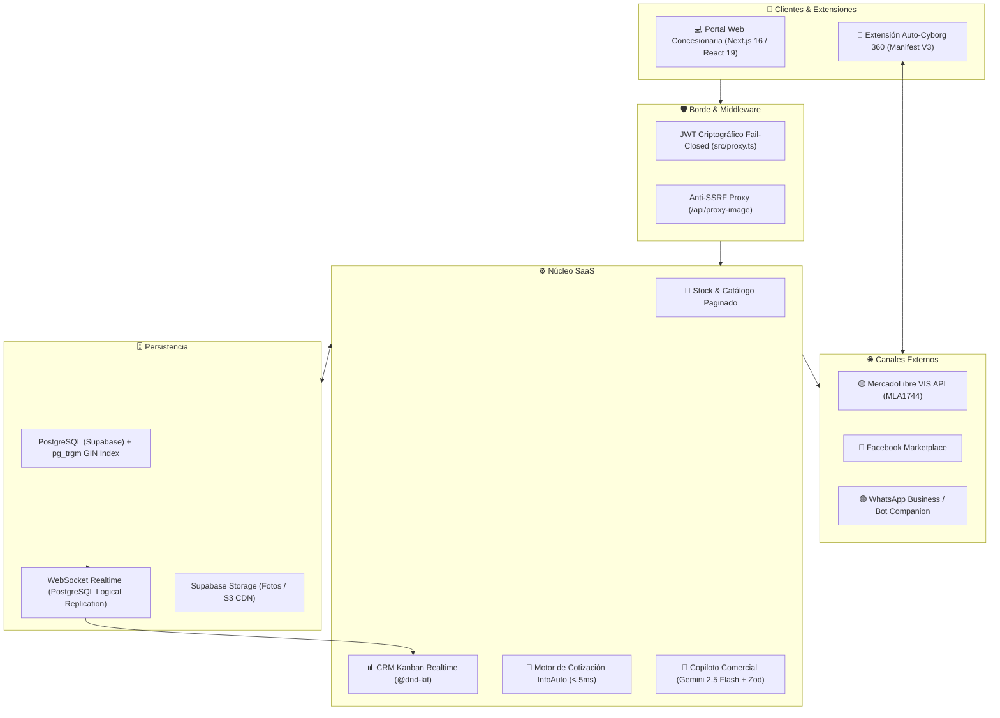

# 🚗 AutoApp — Ecosistema SaaS B2B Automotriz & Copiloto Comercial

[](https://nextjs.org/)
[](https://react.dev/)
[](https://www.typescriptlang.org/)
[](https://supabase.com/)
[](https://ai.google.dev/)
[](https://www.docker.com/)
[](./LICENSE)

Plataforma SaaS B2B desarrollada para modernizar y conectar los flujos de trabajo operativos en concesionarias y agencias de vehículos: gestión de inventario (0KM y Usados), tasación ágil basada en catálogo de mercado, publicación centralizada multicanal y seguimiento de prospectos comerciales asistido por modelos de lenguaje.

---

## 📌 Contexto y Problema que Resuelve

En el comercio automotriz tradicional, las concesionarias suelen enfrentar fricciones operativas diarias:
1. **Dispersión de información:** El inventario vive en planillas de cálculo, los prospectos se dispersan en múltiples chats de WhatsApp y las publicaciones deben cargarse manualmente una por una en cada portal.
2. **Tasaciones lentas o inconsistentes:** Consultar catálogos oficiales (como InfoAuto con más de 8,000 modelos) mediante PDFs o búsquedas rígidas genera demoras de varios minutos frente al cliente y márgenes de permuta difíciles de estandarizar.
3. **Fragilidad en integraciones:** Conectar APIs de terceros (como MercadoLibre VIS) en entornos sin servidor (*Serverless*) suele ocasionar pérdida de tokens o fallas de sesión si no se gestiona una rotación transaccional persistente.

**AutoApp** fue concebido para resolver estas problemáticas a través de una arquitectura limpia, segura y orientada a la experiencia del asesor comercial.

---

## 🏗️ Arquitectura del Sistema

El ecosistema está construido en capas desacopladas que priorizan resiliencia, rendimiento y seguridad:



Para una descripción exhaustiva de contratos, diagramas de secuencia, relaciones de base de datos y diseño de microservicios, consulta [MAPA_COMPLETO_AUTOAPP.md](./MAPA_COMPLETO_AUTOAPP.md).

---

## 🚀 Funcionalidades Principales

### 1. Motor de Tasación Ultrarrápido (< 5ms)
- **Base de Datos Especializada:** Indexación de más de 8,184 versiones de vehículos mediante la extensión `pg_trgm` de PostgreSQL y un índice invertido generalizado (`GIN`).
- **Resiliencia de Búsqueda:** Fallback automático a memoria estructurada (`Map O(1)`) en caso de interrupción momentánea de conexión, asegurando alta disponibilidad.
- **Caché RFC 7234:** Cabeceras `s-maxage=3600, stale-while-revalidate=86400` para resolver consultas frecuentes en el Edge.

### 2. CRM Comercial Kanban con Sincronización en Vivo
- **Pipeline Visual:** Tablero Drag & Drop implementado con `@dnd-kit` y paginación por lotes de 12 tarjetas para mantener 60 FPS estables.
- **Supabase Realtime:** Cambios de estado y nuevos mensajes sincronizados vía WebSocket sin recargar la página.
- **Lead Intelligence:** Clasificación de temperatura de compra (🔥 Caliente, 🟡 Tibio, ❄️ Frío) y sugerencia de *Next Best Action* con generación de respuesta rápida para WhatsApp con un solo clic.

### 3. Publicador Multicanal Asistido por IA
- **Structured Outputs deterministas:** Uso de esquemas `Zod` con el SDK oficial `@google/genai` (modelo `gemini-2.5-flash`) para redactar copys persuasivos adaptados simultáneamente a los formatos de Instagram, Facebook Marketplace, MercadoLibre y WhatsApp.
- **MercadoLibre VIS API:** Flujo OAuth 2.0 con persistencia transaccional y rotación automática de credenciales (`refresh_token`) ante respuestas `401 Unauthorized`.
- **Extensión Auto-Cyborg 360:** Asistente en Chrome (Manifest V3) que aprovecha un hash bridge seguro (`#autoapp=...`) para autocompletar formularios en portales clasificados.

---

## 🛡️ Enfoque de Seguridad & Buenas Prácticas

Durante el proceso de diseño y auditoría técnica, se implementaron medidas para garantizar un entorno confiable:

| Componente | Vulnerabilidad Mitigada | Solución Implementada |
| :--- | :--- | :--- |
| **Middleware de Rutas** | Bypass de autenticación por falsificación de cookies de cliente. | Validación criptográfica JWT directa en servidor mediante `supabase.auth.getUser()` bajo el principio **Fail-Closed**. |
| **Proxy de Imágenes** | Server-Side Request Forgery (SSRF) hacia servicios internos o metadatos de nube. | Cortafuegos con validación estricta de protocolo (`http/https`), bloqueo de direcciones IP privadas (RFC 1918), rechazo de IPs de metadatos (AWS/GCP) y límite de 15 MB. |
| **Tokens de Integración** | Fuga de credenciales en URL o almacenamiento local no cifrado. | Persistencia en base de datos con políticas de seguridad a nivel de fila (RLS), desvinculadas de la memoria volátil de funciones serverless. |

---

## 🛠️ Stack Tecnológico

Agradecemos y nos apoyamos en el trabajo de las siguientes tecnologías de código abierto y plataformas:

- **Frontend & Backend:** [Next.js 16.3.2](https://nextjs.org/) (App Router), [React 19.2.8](https://react.dev/), [TypeScript 5](https://www.typescriptlang.org/).
- **Estilos & UI:** [Tailwind CSS v4](https://tailwindcss.com/), [Lucide React](https://lucide.dev/), [Recharts](https://recharts.org/).
- **Interacciones Drag & Drop:** [@dnd-kit/core](https://dndkit.com/) y `@dnd-kit/sortable`.
- **Base de Datos & Realtime:** [Supabase](https://supabase.com/) ([PostgreSQL 15+](https://www.postgresql.org/), `@supabase/ssr`, `@supabase/supabase-js`).
- **Inteligencia Artificial:** [Google Gemini 2.5 Flash](https://ai.google.dev/) mediante `@google/genai` y validación tipada con [Zod](https://zod.dev/).
- **DevOps & Contenedores:** [Docker](https://www.docker.com/) (Alpine 3.x, compilación multi-stage de ~140 MB).

---

## 💻 Puesta en Marcha Local

### Prerrequisitos
- [Node.js](https://nodejs.org/) v20.x o superior
- [npm](https://www.npmjs.com/) v10.x o superior
- Una instancia de [Supabase](https://supabase.com/) (Cloud o local)
- Una API Key de [Google AI Studio](https://aistudio.google.com/)

### 1. Clonar el repositorio
```bash
git clone https://github.com/thomasskarp/autoapp.git
cd autoapp
```

### 2. Instalar dependencias
```bash
npm install
```

### 3. Configurar variables de entorno
Crea un archivo `.env.local` tomando como base el archivo de ejemplo:
```bash
cp .env.production.example .env.local
```

Completa los valores correspondientes:
```env
NEXT_PUBLIC_SUPABASE_URL=https://tu-proyecto.supabase.co
NEXT_PUBLIC_SUPABASE_ANON_KEY=tu-anon-key
SUPABASE_SERVICE_ROLE_KEY=tu-service-role-key
GEMINI_API_KEY=tu-gemini-api-key
MERCADOLIBRE_CLIENT_ID=tu-app-id
MERCADOLIBRE_CLIENT_SECRET=tu-app-secret
MERCADOLIBRE_REDIRECT_URI=http://localhost:3000/api/mercadolibre/callback
```

### 4. Ejecutar migraciones en Supabase
Ejecuta secuencialmente en el SQL Editor de tu consola de Supabase:
1. `supabase_migration.sql` (Esquema base de stock, leads y perfiles)
2. `supabase_infoauto_migration.sql` (Catálogo InfoAuto con extensión `pg_trgm` e índices GIN)
3. `supabase_agency_integrations.sql` (Credenciales seguras de MercadoLibre)
4. `supabase_phase4_whatsapp_crm.sql` (Campos de inteligencia de leads e interacciones)

Opcionalmente, puebla la base con el script de catálogo:
```bash
node scripts/seed_infoauto.mjs
```

### 5. Iniciar servidor de desarrollo
```bash
npm run dev
```
Abre [http://localhost:3000](http://localhost:3000) en tu navegador.

---

## 🐳 Despliegue con Docker

El proyecto incluye un `Dockerfile` optimizado en 3 etapas (`deps`, `builder`, `runner`) sobre `node:20-alpine`:

```bash
# Construir imagen
docker build -t autoapp:latest .

# Ejecutar contenedor
docker run -p 3000:3000 --env-file .env.local autoapp:latest
```

También puedes orquestarlo con Docker Compose:
```bash
docker compose up -d
```
Verifica el estado del servicio mediante el endpoint de telemetría:
```bash
curl http://localhost:3000/api/health
```

---

## 🧪 Verificación y Pruebas

El repositorio incluye un conjunto de suites de prueba modulares bajo `scripts/`:

```bash
node scripts/test_security_phase1.mjs       # Verificación de Fail-Closed y Anti-SSRF
node scripts/test_phase2_performance.mjs    # Benchmarking de latencia InfoAuto (<5ms)
node scripts/test_phase3_ai.mjs             # Validación de esquemas Zod con Gemini
node scripts/test_phase4_whatsapp_crm.mjs   # Pruebas de integración CRM y Realtime
node scripts/test_phase5_devops.mjs         # Chequeo de telemetría y Docker Health
```

---

## 🤝 Contribuciones y Comunidad

Este proyecto está abierto a retroalimentación, correcciones y mejoras por parte de la comunidad. Si encuentras un problema o tienes una sugerencia constructiva, por favor revisa [CONTRIBUTING.md](./CONTRIBUTING.md) o abre un *Issue* descriptivo.

---

## 📄 Licencia

Distribuido bajo la Licencia MIT. Consulta [LICENSE](./LICENSE) para más detalles.
