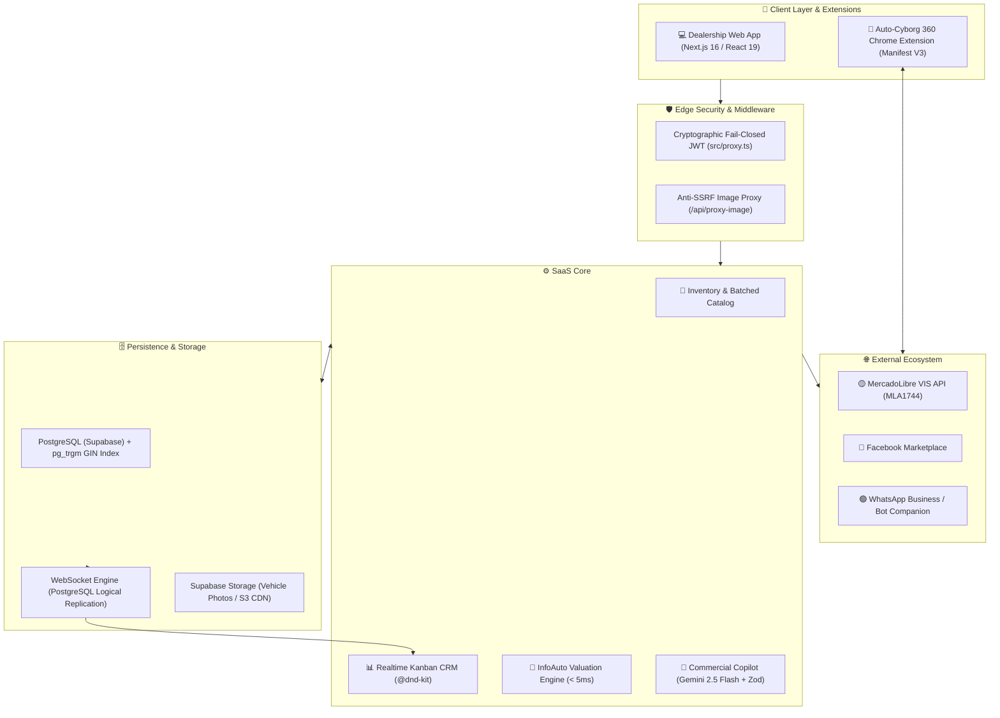

# 🚗 AutoApp — Automotive B2B SaaS Ecosystem & Sales Copilot

[](https://nextjs.org/)
[](https://react.dev/)
[](https://www.typescriptlang.org/)
[](https://supabase.com/)
[](https://ai.google.dev/)
[](https://www.docker.com/)
[](./LICENSE)

An enterprise-ready B2B SaaS platform engineered to streamline and connect automotive dealership operations: unified inventory management (brand new and pre-owned), high-speed market valuation based on official catalogs, automated multichannel publishing, and intelligent prospect follow-up powered by structured LLM workflows.

---

## 📌 Context & Real-World Problem

Automotive retail operations across Latin America frequently struggle with fragmented daily workflows:
1. **Scattered Information:** Inventory is maintained in disconnected spreadsheets, sales leads are lost across personal WhatsApp conversations, and listings must be manually typed into multiple classified portals.
2. **Slow, Inconsistent Valuations:** Reviewing official pricing books (such as InfoAuto with 8,000+ car models) using static PDFs or rigid lookups takes several minutes per customer, making trade-in margins difficult to standardize.
3. **Fragile Third-Party Integrations:** Integrating external APIs (such as MercadoLibre VIS) inside serverless environments often leads to expired tokens or session failures without transactional credential rotation.

**AutoApp** was designed to address these pain points with a clean, decoupled, and resilient architecture tailored to dealership sales advisors and operations managers.

---

## 🏗️ System Architecture

The ecosystem is built across decoupled layers prioritizing resilience, sub-millisecond data access, and strict security boundaries:



For complete relational schemas, sequence diagrams, and microservice definitions, refer to [MAPA_COMPLETO_AUTOAPP.md](./MAPA_COMPLETO_AUTOAPP.md).

---

## 🚀 Key Features

### 1. High-Speed Valuation Engine (< 5ms)
- **Domain-Specific Database Indexing:** Full catalog indexing of 8,184 vehicle models utilizing PostgreSQL `pg_trgm` and Generalized Inverted Indexes (`GIN`).
- **Resilient Fallback:** Automatic failover to an in-memory structured index (`Map O(1)`) during temporary connection drops, ensuring high availability.
- **RFC 7234 Edge Caching:** `s-maxage=3600, stale-while-revalidate=86400` headers resolving repeated requests directly at the edge in `< 50ms`.

### 2. Real-Time Kanban CRM
- **Smooth Drag-and-Drop Pipeline:** Built on top of `@dnd-kit/core` and `@dnd-kit/sortable`, featuring batched rendering (12 cards per stage) to guarantee smooth 60 FPS performance.
- **Supabase Realtime Sync:** Stage updates, lead status transitions, and incoming messages are synced via WebSockets without browser refreshes.
- **Lead Intelligence Copilot:** Heuristic & semantic lead temperature scoring (🔥 Hot, 🟡 Warm, ❄️ Cold) with suggested *Next Best Action* and single-click WhatsApp response generation.

### 3. Multichannel Publishing with Structured AI Outputs
- **Deterministic Structured Outputs:** Enforces `Zod` schemas via the `@google/genai` SDK (`gemini-2.5-flash`) to generate high-converting copy adapted simultaneously for Instagram, Facebook Marketplace, MercadoLibre, and WhatsApp.
- **MercadoLibre VIS API (Category MLA1744):** Full OAuth 2.0 flow with transactional token persistence and automated `refresh_token` renewal on `401 Unauthorized` responses.
- **Auto-Cyborg 360 Extension:** Companion Chrome Extension (Manifest V3) utilizing a secure hash bridge (`#autoapp=...`) to assist sales reps with one-click form completion on third-party portals.

---

## 🛡️ Security & Defensive Engineering

During our architectural audits, production security controls were implemented following OWASP best practices:

| Component | Vulnerability Mitigated | Implementation |
| :--- | :--- | :--- |
| **Route Middleware** | Authentication bypass via forged or stale client cookies. | Server-side cryptographic JWT verification via `supabase.auth.getUser()` under a strict **Fail-Closed** policy. |
| **Media Proxy** | Server-Side Request Forgery (SSRF) targeting internal networks or cloud metadata. | Custom reverse proxy validating protocol schemes (`http/https`), blocking RFC 1918 private IP ranges, rejecting cloud metadata IPs (`169.254.169.254`), and enforcing a 15 MB payload cap. |
| **Integration Secrets** | Credential leakage in URLs or unprotected browser storage. | OAuth tokens stored in isolated PostgreSQL tables with Row Level Security (RLS), decoupled from serverless function memory. |

---

## 🛠️ Technology Stack

We gratefully acknowledge the open-source projects and platforms powering AutoApp:

- **Frontend & Fullstack Core:** [Next.js 16.3.2](https://nextjs.org/) (App Router), [React 19.2.8](https://react.dev/), [TypeScript 5](https://www.typescriptlang.org/).
- **Styling & Design System:** [Tailwind CSS v4](https://tailwindcss.com/), [Lucide React](https://lucide.dev/), [Recharts](https://recharts.org/).
- **Interactive UI:** [@dnd-kit/core](https://dndkit.com/) and `@dnd-kit/sortable`.
- **Database & Realtime:** [Supabase](https://supabase.com/) ([PostgreSQL 15+](https://www.postgresql.org/), `@supabase/ssr`, `@supabase/supabase-js`).
- **Applied Artificial Intelligence:** [Google Gemini 2.5 Flash](https://ai.google.dev/) via `@google/genai` with schema validation by [Zod](https://zod.dev/).
- **DevOps & Containers:** [Docker](https://www.docker.com/) (Alpine 3.x, ~140 MB multi-stage build).

---

## 💻 Local Development

### Prerequisites
- [Node.js](https://nodejs.org/) v20.x or higher
- [npm](https://www.npmjs.com/) v10.x or higher
- A [Supabase](https://supabase.com/) project (Cloud or local)
- A [Google AI Studio](https://aistudio.google.com/) API Key

### 1. Clone the repository
```bash
git clone https://github.com/thomasskarp/autoapp.git
cd autoapp
```

### 2. Install dependencies
```bash
npm install
```

### 3. Configure environment variables
Create a `.env.local` file based on the production example:
```bash
cp .env.production.example .env.local
```

Fill in your service credentials:
```env
NEXT_PUBLIC_SUPABASE_URL=https://your-project.supabase.co
NEXT_PUBLIC_SUPABASE_ANON_KEY=your-anon-key
SUPABASE_SERVICE_ROLE_KEY=your-service-role-key
GEMINI_API_KEY=your-gemini-api-key
MERCADOLIBRE_CLIENT_ID=your-app-id
MERCADOLIBRE_CLIENT_SECRET=your-app-secret
MERCADOLIBRE_REDIRECT_URI=http://localhost:3000/api/mercadolibre/callback
```

### 4. Run database migrations
Execute sequentially in the Supabase SQL Editor:
1. `supabase_migration.sql` (Base schema: stock, leads, user profiles)
2. `supabase_infoauto_migration.sql` (InfoAuto catalog with `pg_trgm` extension and GIN indexes)
3. `supabase_agency_integrations.sql` (MercadoLibre secure token storage)
4. `supabase_phase4_whatsapp_crm.sql` (CRM intelligence fields and interaction history)

Seed the vehicle catalog if needed:
```bash
node scripts/seed_infoauto.mjs
```

### 5. Start the development server
```bash
npm run dev
```
Open [http://localhost:3000](http://localhost:3000) in your browser.

---

## 🐳 Docker Deployment

The project includes an optimized 3-stage `Dockerfile` (`deps`, `builder`, `runner`) on `node:20-alpine`:

```bash
# Build Docker image
docker build -t autoapp:latest .

# Run container
docker run -p 3000:3000 --env-file .env.local autoapp:latest
```

Or run with Docker Compose:
```bash
docker compose up -d
```
Inspect service health using the telemetry endpoint:
```bash
curl http://localhost:3000/api/health
```

---

## 🧪 Test Suites & Verification

The repository contains modular verification scripts under `scripts/`:

```bash
node scripts/test_security_phase1.mjs       # Fail-Closed and Anti-SSRF tests
node scripts/test_phase2_performance.mjs    # InfoAuto sub-5ms latency benchmarking
node scripts/test_phase3_ai.mjs             # Gemini Zod structured output validation
node scripts/test_phase4_whatsapp_crm.mjs   # CRM and Supabase Realtime checks
node scripts/test_phase5_devops.mjs         # Docker health and telemetry checks
```

---

## 🤝 Contributing

Feedback, issue reports, and pull requests are warmly welcomed. Please review [CONTRIBUTING.md](./CONTRIBUTING.md) for guidelines on code standards and branch naming.

---

## 📄 License

Distributed under the MIT License. See [LICENSE](./LICENSE) for details.
